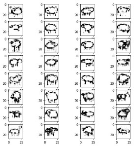
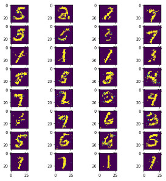

# GAN_Keras
Generative Adversial Network with Keras : 1D / 2D Data generation

Implemented from :
https://medium.com/sigmoid/a-brief-introduction-to-gans-and-how-to-code-them-2620ee465c30

Result after 10 epochs:

## How does it works ?

Generative Adversial Network combines two Neural Networks: a Generator and a Discriminator.

Lets say, first you have a NN model that can tell if there is a sheep in a drawing, the Discriminator.

So, you can plug it after an other model, the "generator", that will have to learn how to draw a sheep.

Generator will output his drawings to the Discriminator (the first ones will not really approximates a sheep's shape as it will be random drawing, not as we could imagine, like a kid's drawing, but a bit more like on a broken TV, every pixel is random...).

The Discriminator will then have to tell if the drawing is a proper sheep or not, and by doing so, will "backpropagate" his results (like a "suggestion") to the genearator, that will use this information to adjust his own weights.

The truth here is, we can start with 2 fresh new models that will learn accordingly, but we will have to break down the training in two steps by training the discriminator first and just freezing it while the generator try to learn...
We dont want the discriminator to change his taste for great drawings... ;)

## Data

Grab here the drawings you like, I choosed a sheep... but there's a lot more there (like horses, horses are great !):
https://console.cloud.google.com/storage/browser/quickdraw_dataset/full/numpy_bitmap?pli=1

