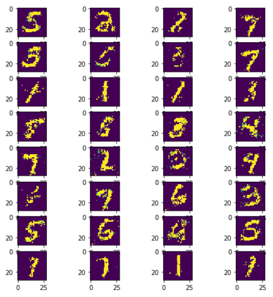

# GAN_Keras
Generative Adversial Network with Keras : 1D / 2D Data generation

Implemented from :
https://medium.com/sigmoid/a-brief-introduction-to-gans-and-how-to-code-them-2620ee465c30

## WIP

Result after a few epochs on MNIST Dataset:

